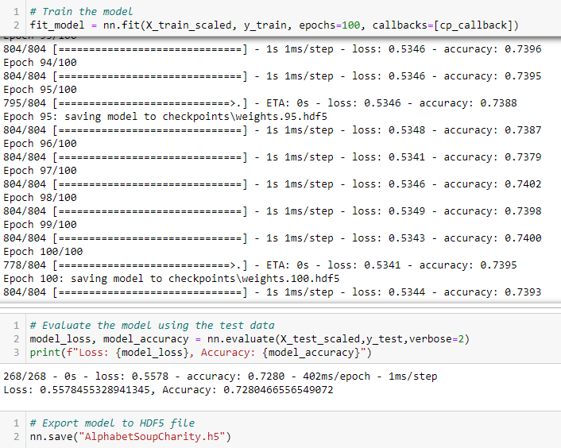
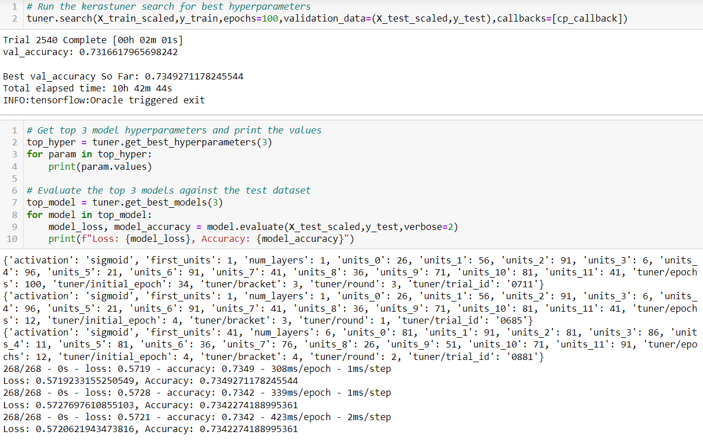

# Neural Network Charity Analysis
Applied neural network models using Python to evaluate and predict where a foundation should make investments.

## Table of contents
* [Overview of Project](#overview-of-project)
* [Data Preprocessing](#data-preprocessing)
* [Compiling, Training, and Evaluating the Models](#compiling-training-and-evaluating-the-models)
* [Summary](#summary)

### Resources
- Data Source: charity_data.csv
- Tools: Python 3.7.13, Jupyter Notebook

## Overview of Project
Created a binary classifier capable of predicting whether charity orgnaizations will be successful if funded by Alphabet Soup. Received a dataset from Alphabet Soup’s business team that contains more than 34,000 organizations that have received funding. Tested additional models to optimize results.

## Results
### Data Preprocessing
- The target variable was the IS_SUCCESSFUL column
  - Funds were effectively used and goals were reached
- Feature variables included all STATUS, ASK_AMT, IS_SUCCESSFUL, APPLICATION_TYPE, AFFILIATION, CLASSIFICATION, USE_CASE, ORGANIZATION, INCOME_AMT, and SPECIAL_CONSIDERATIONS columns
- EIN and NAME columns were dropped
  - EIN could confuse the system into thinking it's a significant number
  - NAME was an unnecessary string
  - STATUS *could* be dropped, as all were 1
  - SPECIAL_CONSIDERATIONS *could* be dropped, few existed

### Compiling, Training, and Evaluating the Models
For my original model there were three hidden layers
- First layer used 80 neurons and relu activation
- Second layer used 20 neurons and relu activation
- Final layer used sigmoid activation
- The result was a loss of 55.8% and accuracy of 73%

In an attempt to optimize and reach an accuracy of 75% or more I implemented Keras Tuner to search for best parameters
- The best model produced loss around 57.2% and accuracy of 73.4%
  - This model used 6 hidden layers and sigmoid activation
- The second and third best models had similar loss and accuracy values
  - These models used 5 and 6 hidden layers, respectively, and sigmoid activation
  
 

## Summary
Keras Tuner didn't improve results significantly, all models tested remain below 75% accuracy. Random Forest Classifiers could be a good model to try out, since they have high accuracy, are easy to interpret, and provides results faster.
